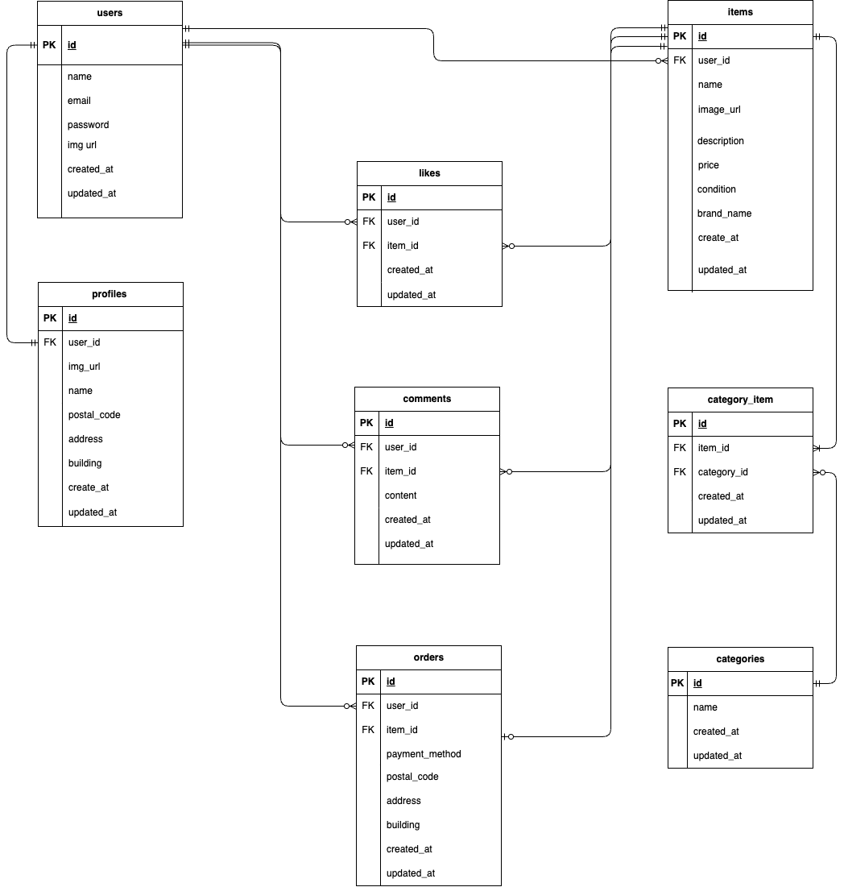

# coachtech-furima  
coachtechフリマアプリの開発プロジェクトです。  
  
## アプリケーションの概要  
本アプリケーションは、ユーザーが商品を自ら出品・購入できるフリマプラットフォームです。  
  
## 使用技術（実行環境）  
・Backend: PHP 8.1/ Laravel 8.x  
・Frontend: Blade / CSS  
・nfrastructure: Docker / Docker Compose  
・Web Server: Nginx 1.21.1  
・Database: MySQL 8.0.35  
・Tool: phpMyAdmin / MailHog  
  
## 環境構築手順  
クローン後、以下の手順で開発環境を起動できます。  
### 1.リポジトリのクローン  
```bash  
git clone https://github.com/Ayana-del/coachtech-furima.git  
```  
```bash
cd coachtech-furima  
```  
### 2.Dockerコンテナの構築・起動  
```bash  
docker-compose up -d --build  
```  
### 3.依存パッケージのインストール  
```bash  
cp src/.env.example src/.env  
```  
```bash  
docker-compose exec php php artisan key:generate  
```  
### 5.マイグレーションの実行  
```bash  
docker-compose exec php php artisan migrate  
```  
  
## URL(開発環境)  
・アプリケーション本体: http://localhost  
・phpMyAdmin (DB管理): http://localhost:8080  
　・サーバー名：mysql  
　・ユーザー名：laravel_user  
　・パスワード：laravel_pass  
## ER図  
