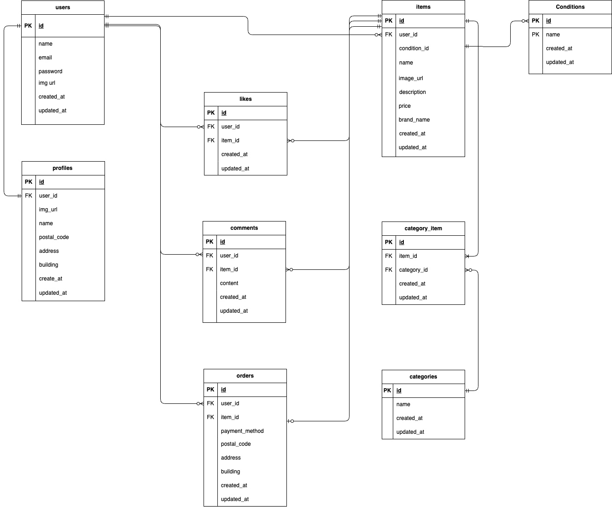

# coachtech-furima

coachtech フリマアプリの開発プロジェクトです。

## アプリケーションの概要

本アプリケーションは、ユーザーが商品を自ら出品・購入できるフリマプラットフォームです。

## 使用技術（実行環境）

開発環境および使用している主要な技術スタックは以下の通りです。

### 1. 開発インフラ / サーバー構成

| 項目         | 技術 / バージョン                            |
| ------------ | -------------------------------------------- |
| インフラ     | Docker / Docker Compose                      |
| Web サーバー | Nginx 1.21.1                                 |
| データベース | MySQL 8.0.35                                 |
| ツール       | phpMyAdmin (DB 管理), MailHog (メールテスト) |

### 2. バックエンド (Backend)

| 項目           | 技術 / バージョン                                |
| -------------- | ------------------------------------------------ |
| 言語           | PHP 8.1                                          |
| フレームワーク | Laravel 8.x                                      |
| 認証パッケージ | Laravel Fortify (会員登録・ログイン・メール認証) |  
| 決済 SDK | Stripe PHP(クレジットカード・コンビニ決済の実装) |  


### 3. フロントエンド (Frontend)

| 項目                 | 技術             |
| -------------------- | ---------------- |
| テンプレート | Blade            |
| スタイリング         | CSS (Native CSS) |

## 環境構築手順

クローン後、以下の手順で開発環境を起動できます。

### 1.リポジトリのクローン

```bash
git clone https://github.com/Ayana-del/coachtech-furima.git
```

```bash
cd coachtech-furima
```
### 2.環境設定ファイルの準備

```bash
cp src/.env.example src/.env
```
  
### 3.Docker コンテナの構築・起動

```bash
docker-compose up -d --build
```
  
### 4.依存パッケージのインストールとキー生成
```bash  
docker-compose exec php composer install  
```
  
```bash
docker-compose exec php php artisan key:generate
```

### 5.マイグレーションの実行

```bash
docker-compose exec php php artisan migrate
```
  
### 6.「シンボリックリンク」の作成を追加  
ブラウザからアップロード画像等を表示できるようにするため、以下のコマンドを実行してください。  
  
```bash
docker-compose exec php php artisan storage:link  
```  
  
### 7.初期データの投入

開発および動作確認のため、以下の手順でダミーデータを投入してください。

```bash
docker-compose exec php php artisan migrate:fresh --seed
```
  
データの整合性を保つため、以下の順序でシーディングを実行する構成としています。  
  
■ シーダー実行順序  
1. UsersTableSeeder:認証ユーザーの作成  
2. ProfilesTableSeeder:各ユーザーのプロフィール（住所等）作成  
3. CategorySeeder:商品カテゴリーのマスター作成  
4. ConditionsTableSeeder:商品状態のマスター作成  
5. ItemsTableSeeder:商品サンプルの作成  
  
- 1. テスト用アカウント  
ログインおよび動作確認用のユーザー情報です。  
  
| 役割 | 名前 | メールアドレス | パスワード | メール認証 |
| ---- | --- | --- | ---- | ---- |

| 出品者 | テストユーザー | test@example.com | password123 | 済み |

| 購入者 | 購入者 次郎 | buyer@example.com | password123 | 済み |

| 未認証 | 未認証 三郎 | guest@example.com | password123 | 未完了 |
- 2. プロフィール初期データ  
各ユーザーに紐づく配送先・基本情報です。  
  
| ユーザーID | 氏名 | 郵便番号 | 住所 | 建物名 |  
| ---- | ---- | ---- | ---- | ---- |  
| 1 | テスト 太郎 | 123-4567 | 東京都渋谷区道玄坂2-11-1 | テックビル101 |  
| 2 | 購入者 次郎 | 530-0001 | 大阪府大阪市北区梅田1-1 | 梅田タワー20F |  
| 3 | 未認証 三郎 | 810-0001 | 福岡県福岡市中央区天神1-1 | 天神プラザ5F |  
  
- 3. カテゴリー（マスタデータ）  
以下の１４種類のカテゴリーを登録し、商品に複数紐付け可能な構成としています。  
・ファッション  
・家電  
・インテリア  
・レディース  
・メンズ  
・コスメ  
・本  
・ゲーム  
・スポーツ  
・キッチン  
・ハンドメイド  
・アクセサリー  
・おもちゃ  
・ベビー・キッズ  
  
- 4. 商品の状態（マスタデータ）  
・良好  
・目立った傷や汚れなし  
・やや傷や汚れあり  
・状態が悪い  
  
- 5. 商品サンプルデータ  
ユーザーID:1（出品者）により登録された、動作確認用の商品10点です。画像は外部S3ストレージのURLを参照しています。  
  
| 商品名 | 価格 | ブランド | 商品の状態 | 商品説明 |  
| ---- | ---- | ---- | ---- | ---- |  
| 腕時計 | ¥15,000 | Rolax | 良好 | スタイリッシュなデザインのメンズ時計 |  
| HDD | ¥5,000 | 西芝 | 目立った傷や汚れなし | 高速で信頼性の高いハードディスク |  
| 玉ねぎ3束 | ¥300 | - | 良好 | 新鮮な玉ねぎ3束のセット |  
| 革靴 | ¥4,000 | - | やや傷や汚れあり | クラシックなデザインの革靴 |  
| ノートPC | ¥45,000 | - | 良好 | 高性能なノートパソコン |  
| マイク | ¥8,000 | - | 良好 | 高音質のレコーディング用マイク |  
| ショルダーバッグ | ¥3,500 | - | 良好 | おしゃれなショルダーバッグ |  
| タンブラー | ¥500 | - | 良好 | 使いやすいタンブラー |  
| コーヒーミル | ¥4,000 | Starbacks | 良好 | 手動のコーヒーミル |  
| メイクセット | ¥2,500 | - | 良好 | 便利なメイクセットアップセット |  
  
■テストデータの使用に関する注意点  
php artisan db:seedによって生成されるサンプル商品データには、以下の仕様が含まれます。  
  
・カテゴリの自動割り当て：商品出品時の「カテゴリー必須」という要件を満たすため、Factoryを用いて全商品に１〜３個のカテゴリーをランダムに紐づけています。  
  
・内容の生合成について:ランダム抽選による紐付けのため、「商品名とカテゴリーの内容が一致しない（例：食品に家電カテゴリーがつく等）」場合があります。これは、あくまでシステム上のバリデーションおよび表示確認を目的としたデータ生成仕様であり、不具合ではありません。  
  

## 開発・管理ツール  
環境構築完了後、以下の URL から各機能にアクセスできます。  
  
| サービス名 | URL | 備考 |  
| ---- | ---- | ---- |  
| アプリケーション本体 | http://localhost | 動作確認用メインページ |  
| phpMyAdmin | http://localhost:8080 | データベース管理ツール |  
| MailHog / Mailtrap | http://localhost:8025 | 送信メール確認用 |  

■phpMyAdmin 接続情報  
データベースの値を直接確認・変更する際は、以下の設定でログインしてください。  
  
サーバー名: mysql  
ユーザー名: laravel_user  
パスワード: laravel_pass

## ER 図



## データベース設計  
本プロジェクトは、機能要件に基づき、９つのテーブルで構成されています。  
  
| テーブル名 | 役割 |  
| ---- | ---- |  
| users | ユーザー認証情報（氏名、メールアドレス、パスワード）を管理します。 |  
| profiles | ユーザーの基本情報（自己紹介画像、住所、本人氏名）を保持します。 |  
| items | 出品された商品の詳細（名前、価格、説明、ブランド等）を管理します。 |  
| conditions | 商品の状態（「良好」「状態が悪い」など）を管理するマスターテーブルです。 |  
| categories | 商品の分類名（「ファッション」「家電」など）を管理するマスターテーブルです。 |  
| category_item | 商品とカテゴリーを多対多で紐づけるための中間テーブルです。 |  
| comments | 商品に対するユーザーからのコメント内容を保持します（最大255文字。 |  
| likes | どのユーザーがどの商品に「いいね」をしたかの履歴を管理します。 |  
| orders | 商品の購入履歴および、購入確定時の支払い方法と配送先住所を保持します。 |  

## モデル・リレーション定義  
Eloquent モデルにおけるリレーションシップの定義一覧です。  
  
■Userモデル  
| メソッド名 | リレーション | 相手モデル | 内容 |  
| ---- | ---- | ---- | ---- |  
| profile() | hasOne | Profile | ユーザーのプロフィール情報を取得 |  
| items() | hasMany | Item | ユーザーが出品した全商品を取得 |  
| orders() | hasMany | Order | ユーザーが購入した商品の注文履歴を取得 |  
  
■Itemモデル  
| メソッド名 | リレーション | 相手モデル | 内容 |  
| ---- | ---- | ---- | ---- |  
| user() | belongsTo | User | 商品を出品したユーザーを特定 |  
| condition() | belongsTo | Condition | 商品の状態（マスター）を特定 |  
| categories() | belongsToMany | Category | 商品に紐付くカテゴリー（複数）を取得 |  
| comments() | hasMany | Comment | 商品に寄せられたコメント一覧を取得 |  
| likes() | hasMany | Like | 商品に付けられた「いいね」一覧を取得 |  
| orders() | hasOne | Order | 商品の注文情報を取得（売却済み判定に使用） |  
  
■Profileモデル  
| メソッド名 | リレーション | 相手モデル | 内容 |  
| ---- | ---- | ---- | ---- |  
| user() | belongsTo | User | プロフィールの所有ユーザーを特定 |  
  
■Categoryモデル  
| メソッド名 | リレーション | 相手モデル | 内容 |  
| ---- | ---- | ---- | ---- |  
| items() | belongsToMany | Item | カテゴリーに属する商品一覧を取得 |  
  
■Conditionモデル  
| メソッド名 | リレーション | 相手モデル | 内容 |  
| ---- | ---- | ---- | ---- |  
| items() | hasMany | Item | その状態に該当する商品一覧を取得 |  
  
■Orderモデル  
| メソッド名 | リレーション | 相手モデル | 内容 |  
| ---- | ---- | ---- | ---- |  
| user() | belongsTo | User | 商品を購入したユーザー（購入者）を特定 |  
| item() | belongsTo | Item | 購入された対象の商品を特定 |  
  
■Comment モデル  
| メソッド名 | リレーション | 相手モデル | 内容 |  
| ---- | ---- | ---- | ---- |  
| user() | belongsTo | User | コメントを投稿したユーザーを特定 |  
| item() | belongsTo | Item | コメントが投稿された対象の商品を特定 |  
  
■Like モデル  
| メソッド名 | リレーション | 相手モデル | 内容 |  
| ---- | ---- | ---- | ---- |  
| user() | belongsTo | User | 「いいね」をしたユーザーを特定 |  
| item() | belongsTo | Item | 「いいね」をされた対象の商品を特定 |  
  
## コントーローラー別機能定義  
各コントローラーが担当する画面と、具体的な処理内容の一覧です。  
  
### 1. ItemController(商品管理・表示)  
商品の閲覧、出品、いいね、コメント投稿といったメイン機能を担当します。  
  
| メソッド名 | 役割 | 処理内容 |  
| ---- | ---- | ---- |  
| index | 商品一覧表示 | 「おすすめ」「マイリスト」の切り替え、キーワード切り替え、自分以外の出品商品の抽出。 |  
| show | 商品詳細表示 | 商品の詳細、コメント一覧の取得、いいね状態の判定。 |  
| toggleLike | いいねの切り替え | ログイン状態を確認し、いいねの登録と解除を交互に実行。 |  
| create | 出品画面表示 | カテゴリーマスター、商品状態を取得して出品フォームを表示。 |  
| store | 出品処理 | 商品画像の保存（storage）、商品データの登録、カテゴリーの多対多紐付け。 |  
| storeComment | コメント投稿 | 商品に対するユーザーのコメントをデータベースに保存。 |  
  
### 2. PurchaseController(決済・購入)  
Stripeを利用した決済フロート、購入完了後の注文データ作成を担当します。  
  
| メソッド名 | 役割 | 処理内容 |  
| ---- | ---- | ---- |  
| showPurchasePage | 購入確認画面 | 商品情報の表示と、配送先（DBまたはセッション）の確定。 |  
| storePurchase | 決済実行 | Stripe Checkoutを利用し、カード・コンビニ決済のセッションを作成・リダイレクト。 |  
| successPurchase | 購入完了処理 | 決済成功後、確定した配送先情報を含めてordersテーブルに記録。 |  
  
### 3. ProfileController(プロフィール管理)  
  
ユーザー情報の変更と、初期設定時のユーザー体験（UX）制御を担当します。  
| メソッド名 | 役割 | 処理内容 |  
| ---- | ---- | ---- |  
| edit | プロフィール表示 | 現在のユーザー情報とプロフィール情報を取得し、編集画面を表示。 |  
| update | プロフィール更新 | 氏名、住所、画像の更新。初回登録時はトップ、２回目以降は編集画面へ遷移。 |  
  
### 4. AddressController(配送先変更)  
  
購入フロー中における、配送先住所の一時的または永続的な変更を担当します。  
| メソッド名 | 役割 | 処理内容 |  
| ---- | ---- | ---- |  
| editAddress | 住所変更画面 | 配送先を変更するための専用フォームを表示。 |  
| updateAddress |住所変更処理 | 選択により「プロフィールDBを更新」または「セッションに一時保存」を切り替え。 |  
  
### 5. MypageController(マイページ表示)  
  
ユーザー自身の活動履歴（出品・購入）の表示を担当します。  
| メソッド名 | 役割 | 処理内容 |  
| ---- | ---- | ---- |  
| index | マイページ表示 | 「出品した商品」「購入した商品」をタブ形式で表示し、それぞれ検索が可能。  

## ルーティング定義
### 1. 公開ルート  
ログインの有無に関わらず、全てのユーザーがアクセス可能なルートです。  
  
| URL | メソッド | ルート名 | 担当コントローラー | 処理内容 |  
| ---- | ---- | ---- | ---- | ---- |  
| / | GET | item.index | ItemController@index | 商品一覧画面の表示 |  
| /item/{item_id} | GET | item.show | ItemController@show | 商品詳細画面の表示 |  
  
### 2. 要認証ルート（メール認証済みユーザーのみ）  
ログインしており、かつメール認証（verified）が完了しているユーザーのみがアクセス可能なメイン機能です。

| カテゴリ | URL | メソッド | ルート名 | 担当コントローラー | 処理内容 |  
| ---- | ---- | ---- | ---- | ---- | ---- |  
| ユーザー | /mypage | GET | mypage.index | MypageController@index | マイページの表示 |  
| | /mypage/profile | GET | profile.edit | ProfileController@edit | プロフィール編集画面の表示 |  
| | /mypage/profile | PATCH | profile.update | ProfileController@update | プロフィール情報の更新 |  
| 商品操作 | /sell | GET | item.create | ItemController@create | 商品出品画面の表示 |  
| | /sell | POST | item.store | ItemController@store | 商品の出品登録処理 |  
| | /item/{item_id}/like | POST | - | ItemController@toggleLike | いいねの登録・解除 |  
| | /item/{item_id}/comment | POST | comment.store | ItemController@storeComment | コメントの投稿 |  
| 購入・配送 | /purchase/{item_id} | GET | purchases.show | PurchaseController@showPurchasePage | 購入確認画面の表示 |  
| | /purchase/{item_id} | POST | purchases.store | PurchaseController@storePurchase | Stripe決済実行 |  
| | /purchase/success/{item_id} | GET | purchase.success | PurchaseController@successPurchase | 購入完了後のDB登録処理 |  
| | /purchase/address/{item_id} | GET | addresses.edit | AddressController@editAddress | 配送先変更画面の表示 |  
| | /purchase/address/{item_id} | PATCH | addresses.update | AddressController@updateAddress | 配送先の更新（セッション・DB） |  
  
### 3. メール認証関連（認証プロセス）  
メール認証を完了させるためのフローおよび、認証リンククリック時の遷移を制御するルートです。  
  
| URL | メソッド | ルート名 | 処理内容 |  
| ---- | ---- | ---- | ---- |  
| /email/verify | GET | verification.notice | メール認証誘導画面（auth.verify-email）の表示 |  
| /email/verification-notification | POST | verification.send | 認証メールの再送信 |  
| /email/verify/{id}/{hash} | GET | verification.verify | 認証完了処理。完了後、「プロフィール編集画面」へ遷移。 |  
  
## ヘッダー機能  
共通レイアウトとして、全ページ（認証画面を除く）で利用可能なナビゲーションと検索機能を提供しています。  
  
### 1. 動的な検索機能  
表示されているページや選択中のタブに応じて、検索対象を自動的に切り替えます。  
  
| 現在のページ | 選択中のタブ | 検索対象 |  
| ---- | ---- | ---- |  
| 商品一覧 | おすすめ | 自分以外の全商品から検索 |  
| | マイリスト | 自分が「いいね」した商品の中から検索 |  
| マイページ | 出品した商品 | 自分が過去に出品した商品から検索 |  
| | 購入した商品 | 自分が過去に購入した商品から検索 |  
  
検索の技術的仕様  
・状態の継承：GETパラメータとしてtab情報を隠しフィールド（hidden）で送信することで、検索後もタブの切り替え状態を維持します。  
・動的なアクション切り替え:閲覧中のURLがマイページ系（/mypage）か否かを判定し、フォームの送信先（action）を適切に切り替えます。  
  
### 2. ナビゲーションメニュー  
認証状態や現在のルートに応じて、表示項目を最適化しています。  
●認証状態による変化：
・未ログイン：「ログイン」「マイページ」「出品」を表示（クリック時はログイン画面へ誘導）。  
・ログイン済み：「ログアウト」「マイページ」「出品」を表示。  
  
●非表示制御：会員登録、ログイン、メール認証誘導画面では、主要な操作に集中させるため検索窓やナビゲーションを非表示にしています。  
  
## メール認証機能  
本アプリケーションでは、セキュリティとユーザーの本人確認を担保するため、特定の操作に対してメール認証を必須としています。  
  
### 1. 認証状態によるアクセス制限  
メール認証の状況に応じて、アクセスできる範囲が厳密にコントロールされています。  
  
| 認証状態 | アクセス可能な画面・機能 |  
| ---- | ---- |  
| 未認証(ゲスト含む) | 商品一覧の閲覧、商品詳細の閲覧 |  
| ログイン済み・メール未認証 | マイページ（一部制限）、認証誘導画面 |  
| ログイン済み・メール認証済み | 全機能（出品、購入、いいね、コメント、配送先変更、プロフィール編集など） |  
  
### 2. 認証誘導画面  
メール認証が必要な機能（出品や購入など）へアクセスしようとした未認証ユーザーに対して表示されます。  
  
・役割：メール内のリンクをクリックして会員登録を完了させるようユーザーに促します。  
  
・再送機能：verification.sendルートを利用し、認証メールを再送信するボタンを設置しています。  
  
### 3. UX(ユーザー体験)の制御  
・ナビゲーションの制限：この画面ではヘッダーの検索窓やメニューを非表示にし、ユーザーが「認証を完了させる」という唯一のタスクに集中できるように設計されています。  
  
・認証後の遷移：メール内のリンクをクリックして認証が完了すると、自動的にプロフィール編集画面へリダイレクトされ、初期設定を促すフローになっています。  
  
## 会員登録機能  
ユーザーが新規アカウントを作成するための画面です。Laravelの標準的な認証フローに基づき、FormRequestによる堅牢なバリデーションを実装しています。  
  
表示画面： `resources/views/auth/register.blade.php`  
バリデーション： `App\Http\Requests\RegisterRequest`  
  
■バリデーション詳細  
  
| 項目 | ルール | メッセージ |  
| ---- | ---- | ---- |  
| ユーザ名 | required, string, max:255 | お名前を入力してください |  
| メールアドレス | required, email, unique:users | メールアドレスを入力してください / メール形式で入力してください |  
| パスワード | required, min:8, confirmed | パスワードを入力してください / 8文字以上で入力してください |  
| 確認用パスワード | (password項目で制御) | パスワードと一致しません |  
  
■会員登録後のフロー  
会員登録ボタン押下後、ユーザーは以下のステップを経てメイン機能を利用可能になります。  
### 1. メール認証誘導画面への遷移  
登録完了直後、ユーザーはログイン状態となりますが、まだ全ての機能は利用できません。システムはverifiedミドルウェアにより、自動的にメール認証画面へリダイレクトします。  
  
### 2. 認証メールの送信  
登録したメールアドレス宛に、システムから自動で「認証用リンク」が記載されたメールが届きます。  
  
### 3. プロフィール設定画面（初回）  
メール内のリンクをクリックすると認証が完了し、初回のみ「プロフィール設定画面」へ遷移します。  
  
### 4. メイン機能の解放  
プロフィールの更新、またはマイページへの遷移をもって、商品の購入・出品・コメント投稿など全ての機能が利用可能になります。  
  

## ログイン機能  
登録済みユーザーがアプリにアクセスするための認証画面です。laravel Fortifyの認証フローをベースに、FormRequestによる独自のバリデーションを実装しています。  
  
表示画面：resources/views/auth/login.blade.php  
バリデーション：App\Http\Requests\LoginRequest  
  
■バリデーション詳細  
  
| 項目 | ルール | メッセージ |  
| ---- | ---- | ---- |  
| メールアドレス | required, string, email | メールアドレスを入力してください / メールアドレスはメール形式で入力してください |  
| パスワード | required, string | パスワードを入力してください |  
  
■ログイン後のフロー  
ログインボタン押下後、システムは以下のプロセスを経てユーザーを誘導します。  
  
### 1. 商品一覧画面へのリダイレクト  
・認証成功後、ユーザーは一律で「商品一覧画面（トップページ）」へと遷移します。  
  
### 2. メール認証状態の制限  
・ログイン完了後、メール認証が済んでいないユーザーに対しては、verifiedミドルウェアによって「メール認証誘導画面」へのアクセス制限がかかります。  
  
### 3. 会員登録画面への導線  
・未登録ユーザー向けに、フォーム下部にroute('register')(会員登録画面)へのリンクを設置しています。  
  
## 商品一覧画面機能  
アプリケーションのトップページであり、全ユーザーが商品を閲覧できるメイン画面です。表示する商品は、タブ選択や検索ワードによって動的に制御されます。  
  
表示画面：resources/views/items/index.blade.php  
  
### 1. 画面構成  
・タブ切り替え機能: 「おすすめ」と「マイリスト」の2つのタブを設置。クエリパラメータ tab を使用して表示内容を切り替えます。  
  
・商品グリッド表示: item-grid クラスを用いたレスポンシブなレイアウトで、商品をカード形式で一覧表示します。  
  
・状態表示: 商品が売り切れ（is_sold が true）の場合、画像の上に「Sold」ラベル（sold-label）を表示します。  
  
### 2. 表示ロジック  
●アクティブタブの判定:  
・mylist タブ選択時：$tab === 'mylist' の条件で「マイリスト」をアクティブ表示。  
  
・それ以外（デフォルト）：「おすすめ」をアクティブ表示。  
  
●画像パスの動的判定：  
・str_starts_with を使用し、画像URLが http から始まる（外部URL）か、storage/ 配下のローカルパスかを自動で判別して表示します。  
  
●空状態のハンドリング:  
・@forelse ディレクティブを活用し、表示対象の商品が1件も存在しない場合は「表示する商品がありません。」というメッセージを表示します。  
  
### 3. 機能詳細  
  
| 項目 | 内容 |  
| ---- | ---- |  
| おすすめ（デフォルト） | 自分以外の全ユーザーが出品した商品を一覧表示。 |  
| マイリスト | ログインユーザーが「いいね」をした商品のみを一覧表示。 |  
| 検索連動 | タブを切り替えても現在の検索ワード（keyword）が維持されるよう、リンクにパラメータを付与。 |  
| 商品詳細リンク | 各商品カードをクリックすることで、商品詳細画面（item.show）へ遷移。 |  
  
### 4. 通知メッセージ  
・セッションメッセージ: 商品購入完了時や出品完了時など、アクション後の通知がある場合は画面上部に alert-success を用いてメッセージを表示します。  
  
## 商品詳細画面機能  
選択した商品の詳細情報を表示し、いいね・コメント・購入検討を行うための画面です。商品の基本情報からユーザー間のコミュニケーションまでを集約しています。  
  
表示画面：resources/views/items/show.blade.php  
  
### 1. 画面構成  
・ビジュアル表示：画面左側に商品画像を配置。URLの形式に応じて、外部ぱす（http開始）かローカルストレージパスかを判別して表示します。  
  
・基本情報：商品名、ブランド名、価格を掲載。  
  
・統計情報：「いいね」の数と「コメント」の数をアイコンとともにリアルタイムに表示します。  
  
・商品の詳細：「商品説明」のテキストに加え、カテゴリーや商品の状態を表示します。  
  
### 2. インタラクティブ機能  
●いいね機能：  
・ハートのアイコンをクリックすることで「いいね」の登録・解除が可能。  
  
・ログイン状況および現在の「いいね」状態に応じて、アイコンの色が動的に切り替わります。  
  
●コメント機能：  
・過去のユーザーコメントをリスト表示。ユーザーアイコンがある場合は画像を表示し、未設定の場合はデフォルトアイコン（👤）を表示します。  
  
・投稿制限：コメントの入力・送信フォームは、@authディレクティブによりログイン済みユーザーのみに表示されます。  
  
・バリデーション：投稿エラー時には、old('comment')により入力内容を保持し、エラーメッセージを表示します。  
  
■コメント機能のバリデーション仕様  
コメントの投稿にはApp\Http\Requests\CommentRequestによる厳密なチェックを実装しています。  
  
| 項目 | ルール | メッセージ |  
| ---- | ---- | ---- |  
| コメント | 必須 (required), 文字列 (string), 255文字以内 (max:255) | コメントを入力してください / コメントは255文字以内で入力してください |  
  
### 3. データ表示ルール  
  
| 項目 | 実装詳細 |  
| ---- | ---- |  
| 価格 | ¥{{ number_format($item->price) }} （税込）の形式で表示。 |  
| カテゴリー | 品に紐づく全てのカテゴリーを @foreach でループし、タグ形式で表示。 |  
| 商品の状態 | condition リレーションから状態名（name）を取得して表示。 |  
| ユーザーアイコン | storage 配下のパスを参照。存在しない場合は代替要素を表示。 |  
  
### 4. 購入導線  
・購入手続きボタン：route('purchases.show')へ遷移し、対象の商品ID（item_id）をパラメータとして引き継ぎます。  
  
  
## 商品出品画面機能  

ユーザーが所有する商品を販売するために、詳細情報を登録する画面です。画像アップロード機能や非道的なプレビュー機能を備えています。  
  
表示画面：resources/views/items/create.blade.php  
バリデーション：App\Http\Requests\ItemRequest  
  
### 1.画面構成と機能  
●画像アップロード・プレビュー：  
・FileReader API（JavaScript）を使用し、画像を選択した瞬間に画面上でプレビューが表示されるよう実装しています。  
  
・enctype="multipart/form-data" を指定し、ファイルデータの送信を可能にしています。  
  
●カテゴリー選択:  
・チェックボックス形式を採用。複数のカテゴリーを同時に選択できる設計です。  
  
・バリデーションエラー時も is_array(old('categories')) による判定を行い、選択状態を保持します。  
  
●商品の詳細設定:  
・「商品の状態」をセレクトボックスから選択。  
  
・価格入力欄は、ブラウザ標準のスピナー（上下矢印）を回避するため type="text" を採用し、CSSでデザインを最適化しています。  
  
### 2. バリデーション仕様  
ItemRequest により、出品に必要な全項目に対して厳密なチェックを行います。  
  
| 項目 | ルール | メッセージ |  
| ---- | ---- | ---- |  
| 商品画像 | 必須, jpeg/png形式 | 商品画像を選択してください / jpegまたはpng形式でアップロードしてください |  
| カテゴリー | 必須 | カテゴリーを選択してください |  
| 商品の状態 | 必須 | 商品の状態を選択してください |  
| 商品名 | 必須 | 商品名を入力してください |  
| 商品の説明 | 必須, 255文字以内 | 商品説明を入力してください / 255文字以内で入力してください |  
| 販売価格 | 必須, 数値, 0円 | 販売価格を入力してください / 数値で入力してください / 0円以上の金額を入力してください |  
  
### 3. 実装ポイント  
●ユーザー体験：  
・全ての入力項目にold()関数を適用。画像や選択ミスでバリデーションエラーが発生しても、入力済みのテキストや選択肢が消えないように配慮しています。  
  
●JavaScriptによる補助:  
・onchange="previewImage(this)" をトリガーに、選択されたファイルをデータURLとして読み込み、即座にブラウザへ反映させることで、投稿前の最終確認を容易にしています。  
  
●セキュリティ:  
・サーバー側でのバリデーションを徹底するため、novalidate を付与。不正なデータや不完全なデータがDBに登録されるのを防いでいます。  
  
## プロフィール編集画面機能  
ユーザーの基本情報（氏名・住所）およびプロフィール画像を管理するための画面です。新規登録後の初期設定と、その後の更新処理の両方を担います。  
  
表示画面： resources/views/profiles/edit.blade.php  
バリデーション： App\Http\Requests\ProfileRequest  
  
### 1. 画面構成と動的機能  
●プロフィール画像管理:  
・プレビュー機能: JavaScript（FileReader）により、ファイル選択時に即座に新しい画像を表示します。画像が未設定の場合はデフォルトのアイコン（👤）を表示します。  
  
・削除機能: すでに画像が登録されている場合のみ「画像を削除する」チェックボックスが出現し、チェックを入れるとプレビューがデフォルト状態に戻る動的な制御を行っています。  
  
●状況に応じたボタン表示:  
・住所が未登録（初期設定時）の場合は「設定完了」、すでに登録済みの場合は「更新する」とボタンの文言を切り替え、ユーザーの操作状況に合わせた表示を行っています。  
  
### 2. バリデーション仕様  
ProfileRequest により、配送等に不可欠な情報の正確性を担保しています。  
  
| 項目 | ルール | メッセージ |  
| プロフィール画像 | 任意, 画像ファイル, jpeg/png形式 | 画像ではありません / .jpeg または .png 形式でアップロードしてください |  
| ユーザー名 | 必須, 20文字以内 | お名前を入力してください / 20文字以内で入力してください |  
| 郵便番号 | 必須, 正規表現（ハイフンあり） | 郵便番号を入力してください / ハイフンありの8文字で入力してください |  
| 住所 | 必須, 255文字以内 | 住所を入力してください |  
| 建物名 | 任意, 255文字以内 | - |  
  
### 3. 実装のポイント  
●データの一貫性:  
・ユーザー名（users テーブル）と、住所情報（profiles テーブル）を一つのフォームで同時に更新する設計です。  
  
・old() 関数の第二引数に現在の登録値を設定することで、入力エラー時でも「入力中の値」または「現在の登録値」が正しく保持されるようにしています。  
  
●フロントエンドの工夫:  
・画像アップロード時にファイル選択をクリアする処理や、削除チェックボックスとの連動など、JavaScriptによる細かなUI制御を実装し、操作ミスを防いでいます。  
  
●セキュリティと整合性:  
・POST リクエストの中で PATCH メソッドを指定（@method('PATCH')）し、リソースの部分更新というセマンティクスに基づいた設計を行っています。  
  


  
## マイページ画面機能  
ログインユーザー自身の情報管理、および「出品した商品」「購入した商品」の履歴を切り替えて閲覧できる画面です。  
  
表示画面： resources/views/mypage/index.blade.php  
  
### 1.ユーザー情報セクション  
●プロフィール表示:  
・設定済みのプロフィール画像を表示します。画像未設定の場合はデフォルトアイコン（👤）を表示します。  
  
・優先表示ロジック: ユーザー名は、プロフィールテーブルに登録がある場合は「プロフィール名（$user->profile->name）」を、未登録の場合は「アカウント名（$user->name）」を優先的に表示します。  
  
●プロフィール編集リンク:  
・route('profile.edit') へのボタンを配置し、情報の更新を円滑に行える導線を確保しています。  
  
### 2. タブ切り替え機能（フロントエンド実装）  
JavaScriptを用いて、ページをリロードせずに表示内容を切り替えるシングルページ的な挙動を実装しています。  
  
・出品した商品: ユーザー自身が過去に出品した商品の一覧。  
  
・購入した商品: ユーザーが過去に購入した商品の一覧。  
  
・状態表示: 他の画面と同様、売り切れ（is_sold）の商品には「Sold」ラベルを表示します。  
  
・空状態のハンドリング: @forelse により、該当する商品がない場合は「〜した商品がありません。」とメッセージを表示します。  
  
### 3. 実装のポイント  
●動的な検索連動:  
・タブ切り替え時に、ヘッダー等の検索フォーム内にある隠しフィールド（search-tab）の値をJavaScriptで書き換えています。  
  
・これにより、「出品した商品」タブを表示中に検索を実行すると、出品商品の中から検索されるといった、タブの状態を維持した検索体験を提供しています。  
  
●URLパラメータの考慮:  
・ページ読み込み時にURLのクエリパラメータ（?tab=buy など）を判定し、初期表示するタブを自動で決定するロジックを搭載しています。  
  
●画像の柔軟な表示:  
・Str::startsWith を使用し、画像パスが外部URLか内部ストレージパスかを自動判別。開発環境と本番環境の両方のパス形式に対応しています。  
  
### 4. 画面遷移  
  
| 項目 | 遷移先 | 内容 |  
| プロフィールを編集 | route('profile.edit') | プロフィール編集画面へ遷移。 |  
| 商品カード | route('item.show') | 各商品の詳細画面へ遷移。 |  
  
## 商品購入画面機能  
Stripe APIを利用した決済処理と、配送先住所の動的な管理を組み合わせた購入フローです。  
  
表示画面： resources/views/purchases/show.blade.php  
バリデーション： App\Http\Requests\PurchaseRequest  
  
### 1. 配送先情報の優先順位ロジック  
購入画面に表示される配送先、および最終的に注文（Order）として記録される住所は、以下の優先順位で決定されます。  
  
・一時的な変更住所: 住所変更画面（addresses.edit）で入力され、セッション（shipping_address）に保持されている情報。  
  
・基本プロフィール住所: セッションにデータがない場合、ログインユーザーのプロフィール情報から自動取得。  
  
### 2.決済・購入フロー  
「購入する」ボタン押下後、以下のステップで処理が進行します。  
■Step 1: サーバー側バリデーション  
・storePurchase メソッドがStripeセッションを作成。  
  
・選択された支払い方法（card または konbini）をStripe側に引き継ぎ、Stripeの決済ページへリダイレクト（303リダイレクト）します。  
  
■Step 2: Stripe Checkoutへのリダイレクト  
・storePurchase メソッドがStripeセッションを作成。  
  
・選択された支払い方法（card または konbini）をStripe側に引き継ぎ、Stripeの決済ページへリダイレクト（303リダイレクト）します。  
  
■Step 3: 購入情報の記録（成功時）  
・決済成功後、Stripeから successPurchase メソッドへ戻ります。  
  
・注文データ（Order）をDBに保存します。この際、前述の優先順位に基づいた住所情報が記録されます。  
  
■後処理とリダイレクト  
・使用した一時的な配送先セッション（shipping_address）を破棄。  
  
・商品一覧画面（item.index）へリダイレクトし、完了メッセージを表示します。  
  
### 3. バリデーション仕様  
PurchaseRequest による厳密なチェック内容です。  
  
### 4. 画面上の動的制御（JavaScript）  
●支払い方法の同期:  
・ユーザーがセレクトボックスで支払い方法を選択すると、サイドバー（購入確認エリア）に選択したテキストが即座に反映されます。  
  

### 5.画面遷移  
●購入するボタンクリック時  
・遷移先： Stripe決済専用画面（外部）  
  
・内容： 決済手続きを行います。  
  
●決済が成功した時  
・遷移先： 商品一覧画面 (item.index). 
  
・通知： 画面上部に 「購入が完了しました」 とメッセージを表示します。  
  
●決済をキャンセルした時  
・遷移先： 商品購入画面 (purchases.show)  
  
・内容： 元の購入確認ページに戻ります。  
  
●住所の「変更する」をクリックした時  
・遷移先： 住所変更画面 (addresses.edit)  
  
・内容： 配送先を一時的に変更するフォームへ移動します。  
  


